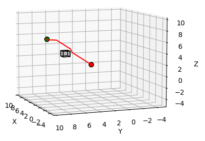
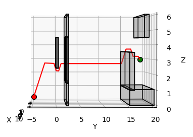
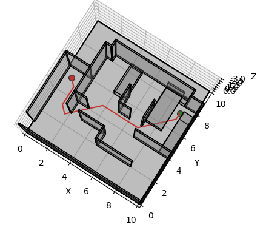
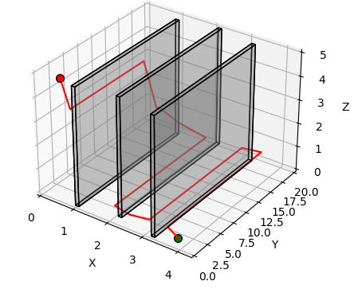
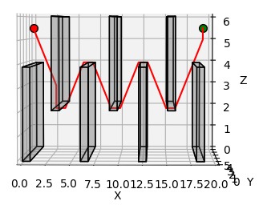
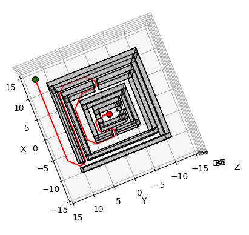

# Search-VS-Sampling-Based-Planning

## Overview
In this project, we implement the weighted A* algorithm, a search based method, to solve the 3D environment obstacle problem. We are to get the agent (starting red coordinate) to the goal location (ending green coordinate) with the least cost while also avoiding all obstacles. We compare this implementation to an existing RRT* implementation. See paper for details.

## Code
### Main.py
Run main.py which will run the weighted A* algorithm on 7 pre-computed environments:  
- Single cube  
- Window  
- Room  
- Monza  
- Flappy Bird  
- Tower  
- Maze  

A_star.py holds all weighted A* algorithm code, including collision detection algorithm.

## Results
Here are some example results  

## Paper
See Search_vs_Sampling_Planning.pdf
